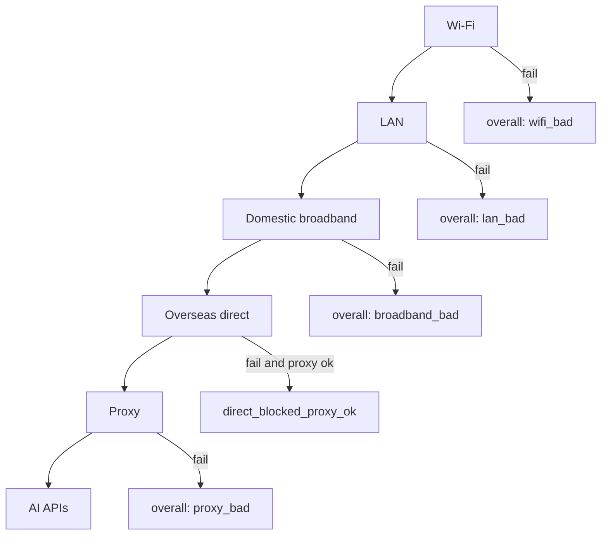

# NetStrata

[中文](README.md) · English

> **Other tools say “the network is down.” NetStrata tells you which layer failed.**

Flaky Wi‑Fi, half-dead proxies, AI APIs that work only via tunnel — you don’t need another ping chart. You need a **layered verdict**: Wi‑Fi → LAN → domestic broadband → overseas direct → proxy → AI APIs. See where it breaks first.

Inspired by [canireach](https://github.com/canireach/canireach), rewritten natively for **Windows** (.NET 8 / WPF / HandyControl). One single-file `NetStrata.exe` covers the main window, tray, and CLI.

---

## 30-second start

```powershell
git clone git@github.com:kongliuli/NetStrata.git
cd NetStrata
dotnet test --filter Category!=Integration
.\scripts\publish.ps1
.\artifacts\publish\NetStrata.exe
```

Optional: copy the published exe to `%LOCALAPPDATA%\NetStrata\` and pin a desktop shortcut.

---

## Layered verdict model



| Layer | What we probe | Semantics |
|-------|---------------|-----------|
| Wi‑Fi | RSSI / rate; wired → `skipped` | Not Wi‑Fi ≠ failure |
| LAN | Gateway ping | If the router is dead, stop blaming the WAN |
| Domestic | Domestic anchors (ping + HTTPS + DNS) | Firewall / DNS-UDP heuristics |
| Overseas | Google / Cloudflare / GitHub… | Direct blocks are expected on restricted nets |
| Proxy | Listener + HTTPS via proxy + egress IP | **No proxy = `skipped`, not fail** |
| AI APIs | OpenAI / Cursor / Anthropic… | Direct vs proxy judged separately |

This is a different problem than PingPlotter (hop-by-hop paths), SmokePing (long-term latency baselines), or Uptime Kuma (is the service up). NetStrata answers: **on a restricted or unstable network, which layer is at fault?**

---

## Feature status

### Shipped

- Single exe: main window + tray + in-process daemon; `--once` / `--tui` / `--export`
- HandyControl UI: Overview / Probe chain / AI·API / Custom targets / Local network
- Six-layer verdict + AI sub-layer; route-change & pattern alerts (tray toast)
- Hot-reload custom ping/HTTPS targets; themes; zh/en UI
- Single-file publish via `scripts/publish.ps1`

### Delivered in this roadmap

- **Single instance** (GUI mutex) — no dual writers on `state.json`
- **Sample retention** — daily `samples-yyyyMMdd.jsonl`, 30-day purge, end-of-file reads
- **Manual probes persist** — tray “Probe now” and `--once` append with `trigger: manual|daemon`
- **History page** — LiveCharts2 RTT lines + layer-state bands (1h / 6h / 24h)
- **Network flow demo** — native WPF animation on Probe chain (layers / direct·proxy / TLS stack); see [docs/NETWORK-FLOW-VISUALIZATION.md](docs/NETWORK-FLOW-VISUALIZATION.md)
- **Configurable judge** — `config.json` → `judge` anchors & thresholds
- **Collector → UI** — Captive / Tailscale / TLS insights / proxy bandwidth on Local network
- **Cycle budget** — whole-cycle timeout + parallel DNS/HTTPS
- **i18n** — engine/conclusions/tray strings via `UiStrings`

### Roadmap (next release focus)

- **Tray-resident** — close main window hides to tray; exit only from tray menu; daemon keeps running
- Multi-channel alerts (Webhook / Telegram, …)
- Optional web dashboard (`--web`)
- Richer trend series (per-HTTPS targets, custom series)

---

## CLI cheat sheet

| Command | Meaning |
|---------|---------|
| `NetStrata` | Main window + tray + in-process daemon |
| `NetStrata --once` | One-shot JSON to stdout (also appended to samples) |
| `NetStrata --tui` / `--follow` | Terminal UI / read-only state |
| `NetStrata --export -o report.md` | Diagnostic report |
| `NetStrata --help` | Help |

---

## Configuration

`%APPDATA%\NetStrata\config.json` (full example: [docs/config.example.json](docs/config.example.json))

```json
{
  "intervalMs": 60000,
  "lang": "en",
  "theme": "system",
  "pingExtra": ["192.168.1.50"],
  "httpsExtra": ["https://example.com/"],
  "judge": {
    "domesticPingTarget": "223.5.5.5",
    "broadbandHttpsDegradedMs": 1500
  }
}
```

Env vars: `NETSTRATA_INTERVAL_MS`, `NETSTRATA_PROXY`, `NETSTRATA_LANG`, `NETSTRATA_THEME`, `NETSTRATA_DOWNLOAD_EVERY`, `NETSTRATA_CONCLUSION_EVERY`.

Data: `%APPDATA%\NetStrata\data\` (rotated samples + `state.json` + `conclusions.md`).

---

## Architecture

```
src/
  NetStrata.Core/     probes · verdict · storage · in-process daemon control
  NetStrata.Daemon/   ProbeDaemon loop
  NetStrata.Tray/     NetStrata.exe (WPF + CLI dispatch)
```

Docs: [docs/USAGE.md](docs/USAGE.md) · [docs/ARCHITECTURE.md](docs/ARCHITECTURE.md) · [docs/WPF-ROADMAP.md](docs/WPF-ROADMAP.md) · [docs/SPEC.md](docs/SPEC.md)

---

## License

See LICENSE. Issues and PRs welcome — especially verdict heuristics and trend UX.
