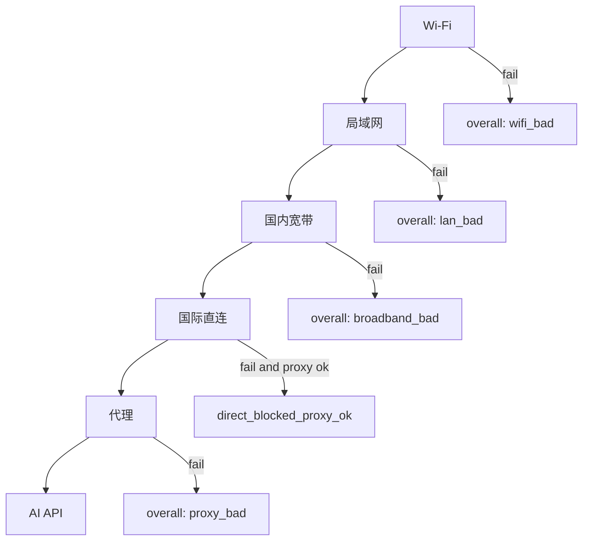

# NetStrata

[English](README.en.md) · 中文

> **别的工具告诉你「网断了」。NetStrata 告诉你断在哪一层。**

受限网络、不稳 Wi‑Fi、代理半死不活、AI API 时通时断——你真正需要的不是又一个 ping 图表，而是一张**分层判决**：Wi‑Fi → 局域网 → 国内宽带 → 国际直连 → 代理 → AI API。哪一层先挂，一眼看见。

受 [canireach](https://github.com/canireach/canireach) 启发，为 **Windows** 原生化重写（.NET 8 / WPF / HandyControl），单文件 `NetStrata.exe` 搞定主窗、托盘与 CLI。

---

## 30 秒上手

```powershell
git clone git@github.com:kongliuli/NetStrata.git
cd NetStrata
dotnet test --filter Category!=Integration
.\scripts\publish.ps1
.\artifacts\publish\NetStrata.exe
```

桌面双击也可以：发布后复制到 `%LOCALAPPDATA%\NetStrata\`，再建快捷方式。

---

## 分层判决模型



| 层 | 看什么 | 语义 |
|----|--------|------|
| Wi‑Fi | RSSI / 速率；有线则 `skipped` | 不是 Wi‑Fi 不算挂 |
| 局域网 | 网关 ping | 路由器都到不了就别怪外网 |
| 国内宽带 | 国内锚点 ping + HTTPS + DNS | 含防火墙/DNS UDP 启发式 |
| 国际直连 | Google / Cloudflare / GitHub… | 直连被拦很正常 |
| 代理 | 监听 + 经代理 HTTPS + 出口 IP | **未配置 = skipped，不是 fail** |
| AI API | OpenAI / Cursor / Anthropic… | 直连与代理分别判定 |

这和 PingPlotter（逐跳路径）、SmokePing（长期延迟基线）、Uptime Kuma（服务是否在线）**不是同一类问题**——NetStrata 专门回答：**受限/不稳定网络下，故障卡在哪一层。**

---

## 功能清单（按状态）

### 已发布

- 单 exe：主窗 + 托盘 + 进程内 Daemon；`--once` / `--tui` / `--export`
- HandyControl 主窗：总览 / 探测链路 / AI·API / 自定义目标 / 本机网络
- 六层判决 + AI 子层；路由变化与模式告警（托盘 Toast）
- 自定义 ping / HTTPS 目标热重载；主题（浅/深/跟随系统）；中英界面
- 单文件发布：`scripts/publish.ps1`

### 本方案已交付（待合入 main / 发布）

- **单实例**：GUI 模式命名 Mutex，避免双开写坏 `state.json`
- **样本保留**：按日 `samples-yyyyMMdd.jsonl`，默认保留 30 天；尾部倒读
- **手动探测入库**：托盘「立即探测」与 `--once` 写入样本流（`trigger: manual|daemon`）
- **历史趋势页**：LiveCharts2 — Ping RTT 折线 + 分层状态色带（1h / 6h / 24h）
- **网络流转演示**：探测链路页原生 WPF 动画（分层 / 直连·代理 / TLS 栈），见 [docs/NETWORK-FLOW-VISUALIZATION.md](docs/NETWORK-FLOW-VISUALIZATION.md)
- **判决可配置**：`config.json` → `judge` 节（国内锚点与阈值）
- **采集消费对齐**：Captive / Tailscale / TLS 洞察 / 代理带宽进「本机网络」
- **周期预算**：整周期超时 + DNS / HTTPS 并行，弱网不易打爆间隔
- **i18n**：引擎/结论/托盘文案走 `UiStrings`（机器英文 → 界面翻译）

### Roadmap（下一版重点）

- **托盘常驻**：关主窗 → 隐藏到托盘；`ShutdownMode.OnExplicitShutdown`；仅托盘「退出」才停 Daemon
- 多通道告警（Webhook / Telegram 等）
- 复活可选 Web 仪表盘（`--web`）
- 更丰富的趋势指标（HTTPS 分目标、自定义序列）

---

## CLI 速查

| 命令 | 说明 |
|------|------|
| `NetStrata` | 主窗 + 托盘 + 进程内 Daemon |
| `NetStrata --once` | 单次探测 JSON → stdout（并写入样本） |
| `NetStrata --tui` / `--follow` | 终端 UI / 只读 state |
| `NetStrata --export -o report.md` | 导出诊断报告 |
| `NetStrata --help` | 帮助 |

---

## 配置要点

`%APPDATA%\NetStrata\config.json`（完整示例：[docs/config.example.json](docs/config.example.json)）

```json
{
  "intervalMs": 60000,
  "lang": "zh",
  "theme": "system",
  "pingExtra": ["192.168.1.50"],
  "httpsExtra": ["https://example.com/"],
  "judge": {
    "domesticPingTarget": "223.5.5.5",
    "broadbandHttpsDegradedMs": 1500
  }
}
```

常用环境变量：`NETSTRATA_INTERVAL_MS`、`NETSTRATA_PROXY`、`NETSTRATA_LANG`、`NETSTRATA_THEME`、`NETSTRATA_DOWNLOAD_EVERY`、`NETSTRATA_CONCLUSION_EVERY`。

数据目录：`%APPDATA%\NetStrata\data\`（日轮转样本 + `state.json` + `conclusions.md`）。

| 文档 | 内容 |
|------|------|
| **[docs/USAGE.md](docs/USAGE.md)** | **安装、命令、配置、数据目录、验收** |
| **[docs/SCHEDULING.md](docs/SCHEDULING.md)** | **CLI/任务计划/Cursor Loop** |
| [docs/PRODUCT.md](docs/PRODUCT.md) | 产品定义、命名 |
| [docs/SPEC.md](docs/SPEC.md) | 探测项与判决规则 |
| [docs/DATA-MODEL.md](docs/DATA-MODEL.md) | Sample / Verdict JSON |
| [docs/ARCHITECTURE.md](docs/ARCHITECTURE.md) | 解决方案结构 |
| [docs/WINDOWS.md](docs/WINDOWS.md) | Windows 探测对照 |
| [docs/LAYER3.md](docs/LAYER3.md) | TLS 栈、告警、导出 |
| [docs/TESTING.md](docs/TESTING.md) | 测试规格 |
| [docs/ROADMAP.md](docs/ROADMAP.md) | 分期计划 |
| [docs/WPF-ROADMAP.md](docs/WPF-ROADMAP.md) | WPF 与单 exe 架构 |
| [docs/NETWORK-FLOW-VISUALIZATION.md](docs/NETWORK-FLOW-VISUALIZATION.md) | WPF 多层网络流转、动画与数据语义 |
| [scripts/README.md](scripts/README.md) | agent-loop、health-check |

---

## 架构一览

```
src/
  NetStrata.Core/     探测 · 判决 · 存储 · Flow · 进程内 Daemon 控制
  NetStrata.Daemon/   ProbeDaemon 循环
  NetStrata.Tray/     NetStrata.exe（WPF + CLI 分发）
```

深入文档：[docs/USAGE.md](docs/USAGE.md) · [docs/ARCHITECTURE.md](docs/ARCHITECTURE.md) · [docs/WPF-ROADMAP.md](docs/WPF-ROADMAP.md) · [docs/NETWORK-FLOW-VISUALIZATION.md](docs/NETWORK-FLOW-VISUALIZATION.md) · [docs/SPEC.md](docs/SPEC.md)

---

## 许可

见仓库 LICENSE。欢迎 Issue / PR——尤其是判决启发式与趋势可视化的改进。
