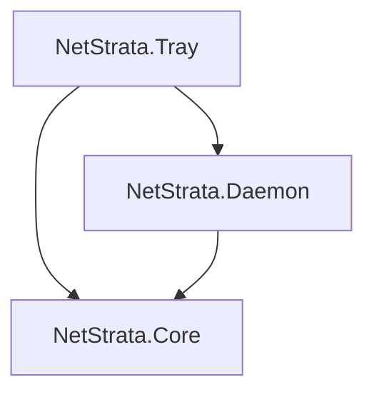

# 架构设计

## 解决方案结构

```
NetStrata/
├── src/
│   ├── NetStrata.Core/                # 核心业务逻辑（无 UI 依赖）
│   │   ├── Probes/                    # 各探测项实现
│   │   ├── Judge/                     # 分层判决引擎
│   │   ├── Collector/                 # 并行采集调度
│   │   ├── Models/                    # 数据模型
│   │   ├── Config/                    # 环境变量 / 选项
│   │   ├── Cli/                       # 进程内 Daemon / Once / 参数解析
│   │   └── Storage/                   # jsonl / state 读写
│   ├── NetStrata.Daemon/              # ProbeDaemon 循环
│   └── NetStrata.Tray/                # NetStrata.exe：WPF 托盘 + CLI 分发
├── tests/
│   └── NetStrata.Core.Tests/          # 单元测试（mock，不启 GUI/真进程）
├── docs/
├── web/                               # 静态资源（Web 仪表盘后续）
├── NetStrata.slnx
└── README.md
```

---

## 模块依赖



**依赖规则**：
- `Core` 不依赖 `Tray` / `Daemon`
- 所有探测逻辑在 `Core`，便于单元测试
- `Daemon` 仅负责定时调用 `SampleCollector` + 持久化
- Tray 进程内跑 `ProbeDaemon`；CLI 子命令由同 exe `CommandDispatcher` 分发
- Web 仪表盘本阶段不做
---

## 核心接口

### IProbe\<T\>

```csharp
public interface IProbe<T>
{
    string Name { get; }
    Task<T> ProbeAsync(CancellationToken ct);
}
```

### 探测实现清单

| 类 | 返回类型 | Phase |
|----|----------|-------|
| `WifiProbe` | `WifiInfo` | 2 |
| `InterfaceProbe` | `InterfaceInfo` | 1 |
| `PingProbe` | `IReadOnlyList<PingResult>` | 1 |
| `DnsProbe` | `IReadOnlyList<DnsResult>` | 1 |
| `HttpsProbe` | `IReadOnlyList<HttpsResult>` | 1 |
| `ProxyConfigProbe` | `ProxyConfig` | 2 |
| `ProxyEgressProbe` | `ProxyEgress?` | 2 |
| `CaptiveProbe` | `CaptiveResult` | 3 |
| `ProxyDownloadProbe` | `ProxyDownload?` | 3 |
| `TailscaleProbe` | `TailscaleInfo` | 4 |
| `TlsStackProbe` | `IReadOnlyList<TlsStackResult>` | 5a |
| `RouteWatch` | `IReadOnlyList<Alert>` | 5b |

### RouteWatch / ConclusionEngine（Layer 3）

```csharp
public sealed class RouteWatch
{
    public IReadOnlyList<Alert> Compare(Sample? previous, Sample current);
}

public sealed class ConclusionEngine
{
    public string GenerateMarkdown(IReadOnlyList<Sample> samples);
}
```

纯函数，无 I/O。见 [LAYER3.md](LAYER3.md)。

### SampleCollector

```csharp
public sealed class SampleCollector
{
    public async Task<Sample> CollectAsync(
        CollectOptions options,
        CancellationToken ct);
}
```

职责：
1. 调用 `InterfaceProbe` 获取网关
2. 并行调度所有 Probe
3. 调用 `VerdictEngine.Judge(sample)` 附加判决
4. 返回完整 `Sample`

### VerdictEngine

```csharp
public sealed class VerdictEngine
{
    public Verdict Judge(Sample sample);
}
```

纯函数，无 I/O。逻辑移植自 canireach `judge()`，见 [SPEC.md](SPEC.md#3-分层判决judge)。

---

## HTTP 探测设计

### 直连 HttpClient

```csharp
var handler = new SocketsHttpHandler
{
    UseProxy = false,           // 关键：禁用系统代理
    ConnectTimeout = TimeSpan.FromSeconds(8),
    AutomaticDecompression = DecompressionMethods.All,
};
var client = new HttpClient(handler) { Timeout = TimeSpan.FromSeconds(8) };
```

### 代理 HttpClient

```csharp
var handler = new SocketsHttpHandler
{
    Proxy = new WebProxy("http://127.0.0.1:7890"),
    UseProxy = true,
};
```

### 时序分段

用 `Stopwatch` 或 `Activity` 记录：
- DNS → Connect → TLS → FirstByte → Total

若精确分段成本高，Phase 1 可只记录 `totalMs`，Phase 2 再细化。

---

## Ping 探测设计

```csharp
using var ping = new Ping();
var reply = await ping.SendPingAsync(target, timeoutMs: 1500);
```

注意：
- Windows 防火墙可能禁 ICMP → 记录 `err`，判决时 HTTPS 正常则 broadband 不应仅凭 ping fail
- Phase 2 增加 **「ping 失败但 HTTPS 成功 → degraded 而非 fail」** 的 Windows 特化逻辑（见 [WINDOWS.md](WINDOWS.md)）

---

## DNS 探测设计

**推荐**：`DnsClient` NuGet 包（`LookupClient`）指定 nameserver。

```csharp
var client = new LookupClient(IPAddress.Parse("223.5.5.5"));
var result = await client.QueryAsync("baidu.com", QueryType.A);
```

`system` 服务器：使用系统默认 DNS（`LookupClient` 不传 nameserver）。

---

## 代理检测设计

`ProxyDetector` 按优先级返回 `proxyUrl`：

```csharp
public sealed class ProxyDetector
{
    public string? Detect();
}
```

来源：
1. `NetStrataOptions.ProxyOverride`（来自 `NETSTRATA_PROXY`）
2. 环境变量
3. `WindowsSystemProxyReader`（注册表）
4. `WinHttpProxyReader`（netsh）
5. `LocalPortScanner`（可选 fallback）

---

## Daemon 设计

```csharp
public sealed class ProbeDaemon : BackgroundService
{
    protected override async Task ExecuteAsync(CancellationToken ct)
    {
        while (!ct.IsCancellationRequested)
        {
            var sample = await _collector.CollectAsync(options, ct);
            await _storage.AppendSampleAsync(sample, ct);
            await _storage.WriteStateAsync(sample, ct);
            await Task.Delay(interval - elapsed, ct);
        }
    }
}
```

---

## 存储设计

```
%APPDATA%\NetStrata\
├── data\
│   ├── samples.jsonl      # 追加，每行一个 Sample JSON
│   └── state.json         # 覆盖写入
└── logs\
    └── daemon.log
```

```csharp
public interface ISampleStorage
{
    Task AppendAsync(Sample sample, CancellationToken ct);
    Task<IReadOnlyList<Sample>> ReadTailAsync(int limit, CancellationToken ct);
    Task WriteStateAsync(DaemonState state, CancellationToken ct);
    Task<DaemonState?> ReadStateAsync(CancellationToken ct);
}
```

---

## CLI 入口

同一 `NetStrata.exe`：无参 → 托盘；`--once` / `--export` / `--tui` / `--follow` / `--help` → `CommandDispatcher`。`--web` 本阶段返回未启用提示。

---

## 配置

从环境变量 `NETSTRATA_*` 与 `config.json` 加载。`PingExtra` 合并顺序：config → env → CLI `--ping`（当次）。托盘设置保存后热重载进程内 Daemon。

---

## 测试策略

遵循 Ponytail 约束：

| 测什么 | 怎么测 |
|--------|--------|
| `VerdictEngine` | 纯输入 Sample → 断言 verdict，无 I/O |
| `InProcessDaemonController` | 注入 loop 委托，断言 Start/Stop/Restart |
| `OnceProbeRunner` | mock `ISampleCollector` |
| `RouteWatch` / `ConclusionEngine` | 纯函数 |
| 集成测试 | `[Trait("Category", "Integration")]`，默认跳过 |

**禁止**在单元测试中 `Process.Start` 真实浏览器或系统 exe。

---

## 发布

```powershell
.\scripts\publish.ps1
```

输出：`artifacts/publish/NetStrata.exe`（WPF + CLI 单文件）
