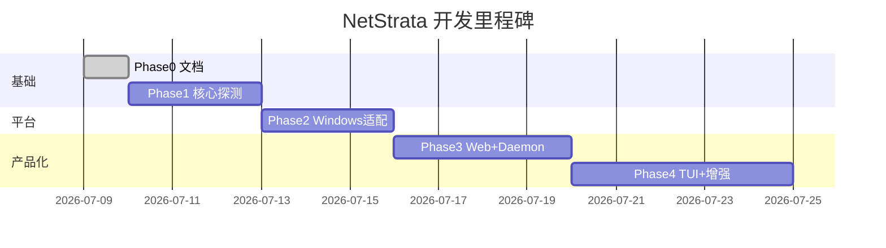

# 开发路线图

## Phase 0：文档 ✅（当前）

- [x] 产品命名 NetStrata
- [x] 功能规格、数据模型、架构、Windows 对照、API、路线图
- [x] Git 仓库初始化

**验收**：开发者仅凭文档即可开始编码。

---

## Phase 1：核心探测 MVP

**目标**：`netstrata --once` 在 Windows 上输出正确 JSON。

### 任务

- [ ] 创建 `NetStrata.sln` + 项目结构
- [ ] `Models/` — Sample、PingResult、HttpsResult、DnsResult、Verdict 等
- [ ] `InterfaceProbe` — 网关、IPv4、linkType
- [ ] `PingProbe` — 网关 + 4 个公网 IP
- [ ] `DnsProbe` — 20 条矩阵（DnsClient NuGet）
- [ ] `HttpsProbe` — 7 个直连目标，直连禁用代理
- [ ] `VerdictEngine` — 完整 6 层判决 + overall + ai headline
- [ ] `SampleCollector` — 并行调度
- [ ] `NetStrata.Cli --once` — stdout JSON
- [ ] 单元测试：`VerdictEngine` 至少 5 个场景

### 验收标准

```powershell
netstrata --once | ConvertFrom-Json
# 网络正常时：
#   verdict.overall = "healthy" 或 "direct_blocked_proxy_ok"
#   pings[223.5.5.5].ok = true
#   https[baidu_direct].ok = true
# 不应出现 "exit null" 类错误
```

### 预估工时

2–3 天

---

## Phase 2：Windows 平台适配

**目标**：代理检测、系统代理读取、Wi-Fi 信息、端口监听。

### 任务

- [ ] `ProxyDetector` — 环境变量 → 注册表 → WinHTTP → 端口扫描
- [ ] `ProxyConfigProbe` — listening + listenerProcess
- [ ] `HttpsProbe` 代理分支 — 6 个 proxy 目标
- [ ] `ProxyEgressProbe` — ipify / ifconfig.me
- [ ] `WifiProbe` — netsh wlan show interfaces
- [ ] Ping 防火墙修正 — ping fail + https ok → degraded
- [ ] `NETSTRATA_PROXY` / 全部环境变量支持
- [ ] 数据目录 `%APPDATA%\NetStrata\`

### 验收标准

```powershell
# 开 Clash Verge 后：
$env:NETSTRATA_PROXY='http://127.0.0.1:7897'
netstrata --once
# proxyConfig.listening = true
# proxyConfig.listenerProcess 含 verge-mihomo 或类似
# https[google_proxy].ok = true
# proxyEgress.ip 有值
```

### 预估工时

2–3 天

---

## Phase 3：Daemon + Web 仪表盘

**目标**：`netstrata --web` 持续监控 + 浏览器仪表盘。

### 任务

- [ ] `ProbeDaemon` — BackgroundService 循环
- [ ] `SampleStorage` — samples.jsonl 追加 + state.json
- [ ] `NetStrata.Web` — /api/state, /api/samples, /api/series
- [ ] `SeriesBuilder` — 时序数据聚合
- [ ] 移植/适配 `web/index.html` 前端
- [ ] `NETSTRATA_INTERVAL_MS` / `NETSTRATA_PORT` / `NETSTRATA_NO_OPEN`
- [ ] `CaptiveProbe`
- [ ] `ProxyDownloadProbe`（每 N 轮）
- [ ] 日志 `logs/daemon.log`

### 验收标准

```powershell
$env:NETSTRATA_NO_OPEN='1'
$env:NETSTRATA_INTERVAL_MS='20000'
netstrata --web
# http://localhost:8787 可访问
# 每 20s 有新样本写入 jsonl
# 图表随时间更新
```

### 预估工时

3–4 天

---

## Phase 4：TUI + 增强

**目标**：终端面板 + 可选高级功能。

### 任务

- [ ] `NetStrata.Tui` — Spectre.Console Live 面板
- [ ] TUI follow 模式（读已有 daemon 的 jsonl）
- [ ] 中英文切换（`l` 键 + `NETSTRATA_LANG`）
- [ ] `TailscaleProbe`
- [ ] `/api/conclusions` 规则引擎
- [ ] 系统托盘图标（可选 WPF/WinForms）
- [ ] 单文件发布 `netstrata.exe`

### 验收标准

- TUI 实时显示 6 层状态
- `dotnet publish` 产出单文件 exe < 30MB
- 无终端依赖，双击或 `netstrata --web` 即可用

### 预估工时

3–5 天

---

## 里程碑总览



---

## 技术债务备忘

| 项 | 说明 | 处理阶段 |
|----|------|----------|
| HTTPS 时序分段 | Phase 1 仅 totalMs | Phase 2+ |
| SOCKS5 代理 | 仅 HTTP 代理 | 按需 |
| IPv6 支持 | 仅 IPv4 | 按需 |
| 多网卡 VPN 干扰 | 默认路由选择 | Phase 2 |
| 前端 systemProxy 字段 | 与 canireach scutil 差异 | Phase 3 |

---

## 第一个 PR 建议范围

最小可合并单元：

```
src/NetStrata.Core/
  Models/*.cs
  Judge/VerdictEngine.cs
  Probes/PingProbe.cs
  Probes/HttpsProbe.cs
  Collector/SampleCollector.cs
tests/NetStrata.Core.Tests/
  Judge/VerdictEngineTests.cs
```

不包含 Web/Daemon，确保 `--once` 可跑通。
