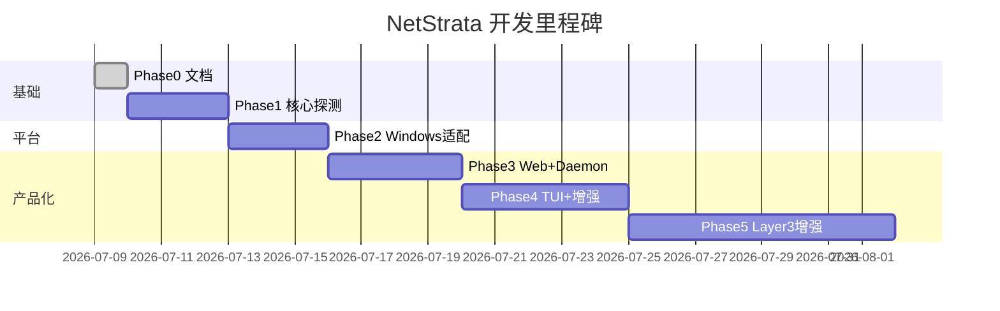

# 开发路线图

## Phase 0：文档 ✅

- [x] 产品命名 NetStrata
- [x] 功能规格、数据模型、架构、Windows 对照、API、路线图
- [x] Git 仓库初始化
- [x] Layer 3 规格（[LAYER3.md](LAYER3.md)）
- [x] 测试先行规格（[TESTING.md](TESTING.md)）
- [x] 自定义 Ping 规格（Phase 2.5）

**验收**：开发者仅凭文档即可开始编码；每项实现前有对应测试用例。

---

## Phase 1：核心探测 MVP ✅

**目标**：`netstrata --once` 在 Windows 上输出正确 JSON。

### 任务

- [x] 创建 `NetStrata.sln` + 项目结构
- [x] `Models/` — Sample、PingResult、HttpsResult、DnsResult、Verdict 等
- [x] `InterfaceProbe` — 网关、IPv4、linkType
- [x] `PingProbe` — 网关 + 4 个公网 IP
- [x] `DnsProbe` — 20 条矩阵（DnsClient NuGet）
- [x] `HttpsProbe` — 7 个直连目标，直连禁用代理
- [x] `VerdictEngine` — 完整 6 层判决 + overall + ai headline
- [x] `SampleCollector` — 并行调度
- [x] `NetStrata.Cli --once` — stdout JSON
- [x] 单元测试：`VerdictEngine` 至少 5 个场景（当前 11 个）

### 验收标准

```powershell
netstrata --once | ConvertFrom-Json
# 网络正常时：
#   verdict.overall = "healthy" 或 "direct_blocked_proxy_ok"
#   pings[223.5.5.5].ok = true
#   https[baidu_direct].ok = true
# 不应出现 "exit null" 类错误
```

### 预估工时

2–3 天

---

## Phase 2.5：自定义 Ping（Layer 3 前置）

**目标**：用户可监控内网/自定义 IP，结果出现在 JSON 与图表中。

### 任务

- [ ] `UserConfig` 读取 `%APPDATA%\NetStrata\config.json`
- [ ] `NETSTRATA_PING_EXTRA` 环境变量
- [ ] CLI `--ping` 单次参数
- [ ] `PingProbe` 合并内置 + extra（上限 10）
- [ ] `PingResult.custom` / `label` 字段
- [ ] `SeriesBuilder` 含 `custom_*` 时序键
- [ ] 单元测试：见 [TESTING.md](TESTING.md#自定义-ping-专项)

### 验收标准

```powershell
$env:NETSTRATA_PING_EXTRA='192.168.1.1'
netstrata --once | ConvertFrom-Json | Select-Object -Expand pings | Where-Object custom
# 含 192.168.1.1，custom=true，verdict 六层不受影响
```

### 预估工时

0.5–1 天（可与 Phase 2 并行）

---

## Phase 2：Windows 平台适配

**目标**：代理检测、系统代理读取、Wi-Fi 信息、端口监听。

### 任务

- [x] `ProxyDetector` — 环境变量 → 注册表 → 端口扫描（WinHTTP 待补）
- [x] `ProxyConfigProbe` — listening + listenerProcess
- [x] `HttpsProbe` 代理分支 — 6 个 proxy 目标
- [x] `ProxyEgressProbe` — ipify / ifconfig.me
- [ ] `WifiProbe` — netsh wlan show interfaces
- [x] Ping 防火墙修正 — ping fail + https ok → degraded
- [x] `NETSTRATA_PROXY` / `NETSTRATA_PING_EXTRA` 环境变量
- [ ] 数据目录 `%APPDATA%\NetStrata\`

### 验收标准

```powershell
# 开 Clash Verge 后：
$env:NETSTRATA_PROXY='http://127.0.0.1:7897'
netstrata --once
# proxyConfig.listening = true
# proxyConfig.listenerProcess 含 verge-mihomo 或类似
# https[google_proxy].ok = true
# proxyEgress.ip 有值
```

### 预估工时

2–3 天

---

## Phase 3：Daemon + Web 仪表盘

**目标**：`netstrata --web` 持续监控 + 浏览器仪表盘。

### 任务

- [ ] `ProbeDaemon` — BackgroundService 循环
- [ ] `SampleStorage` — samples.jsonl 追加 + state.json
- [ ] `NetStrata.Web` — /api/state, /api/samples, /api/series
- [ ] `SeriesBuilder` — 时序数据聚合
- [ ] 移植/适配 `web/index.html` 前端
- [ ] `NETSTRATA_INTERVAL_MS` / `NETSTRATA_PORT` / `NETSTRATA_NO_OPEN`
- [ ] `CaptiveProbe`
- [ ] `ProxyDownloadProbe`（每 N 轮）
- [ ] 日志 `logs/daemon.log`

### 验收标准

```powershell
$env:NETSTRATA_NO_OPEN='1'
$env:NETSTRATA_INTERVAL_MS='20000'
netstrata --web
# http://localhost:8787 可访问
# 每 20s 有新样本写入 jsonl
# 图表随时间更新
```

### 预估工时

3–4 天

---

## Phase 4：TUI + 增强

**目标**：终端面板 + 可选高级功能。

### 任务

- [ ] `NetStrata.Tui` — Spectre.Console Live 面板
- [ ] TUI follow 模式（读已有 daemon 的 jsonl）
- [ ] 中英文切换（`l` 键 + `NETSTRATA_LANG`）
- [ ] `TailscaleProbe`
- [ ] `/api/conclusions` 规则引擎
- [ ] 系统托盘图标（可选 WPF/WinForms）
- [ ] 单文件发布 `netstrata.exe`

### 验收标准

- TUI 实时显示 6 层状态
- `dotnet publish` 产出单文件 exe < 30MB
- 无终端依赖，双击或 `netstrata --web` 即可用

### 预估工时

3–5 天

---

## Phase 5：Layer 3 增强（第三层）

**目标**：Windows 分层网络诊断参考实现。规格见 [LAYER3.md](LAYER3.md)，测试见 [TESTING.md](TESTING.md#layer-3增强层)。

### Phase 5a：TLS/SNI 栈探测

- [ ] `TlsStackProbe` — DNS→TCP→TLS→HTTP
- [ ] `config.json` → `tlsStackTargets`
- [ ] `verdict.insights` 信息性条目
- [ ] 单元测试：TlsProbeTests

### Phase 5b：告警与路由提示

- [ ] `RouteWatch` — 网关/出口/网卡变化
- [ ] `proxy_down` / `egress_flapping` 连续轮次规则
- [ ] `iface.routeHints` 多默认路由 / Tailscale
- [ ] `state.recentAlerts` 持久化
- [ ] Web 横幅 + TUI 摘要

### Phase 5c：结论与导出

- [ ] `ConclusionEngine` + `/api/conclusions`
- [ ] `data/conclusions.md` 周期性写入
- [ ] `netstrata --export` + `GET /api/export`
- [ ] 结论规则含自定义 ping 失败（R05）

### Phase 5d：系统托盘（可选）

- [ ] `NetStrata.Tray` — 图标状态映射
- [ ] `TrayStatusMapper` 单测，不启动真实托盘

### 验收标准

```powershell
netstrata --web
# 断开代理 3 轮后出现 proxy_down alert
netstrata --export --minutes 60 -o report.md
# report 含 overall 分布、custom ping、alerts
curl http://localhost:8787/api/conclusions
# 返回 Markdown
```

### 预估工时

5–8 天（5d 可选另计）

---

## 里程碑总览



---

## 技术债务备忘

| 项 | 说明 | 处理阶段 |
|----|------|----------|
| HTTPS 时序分段 | Phase 1 仅 totalMs | Phase 2+ |
| SOCKS5 代理 | 仅 HTTP 代理 | 按需 |
| IPv6 支持 | 仅 IPv4 | 按需 |
| 多网卡 VPN 干扰 | 默认路由选择 | Phase 2 |
| 前端 systemProxy 字段 | 与 canireach scutil 差异 | Phase 3 |
| Layer 3 TLS 探测精度 | 部分环境需 Integration 测试 | Phase 5a |
| 自定义 ping 滥用 | 上限 10 + 不参与 verdict | Phase 2.5 |

---

## 开发原则

1. **文档先行** — 改行为先改 `docs/`，见 [LAYER3.md](LAYER3.md)、[TESTING.md](TESTING.md)
2. **测试先行** — 先写 `tests/` 失败用例，再实现
3. **最小 PR** — 每个 Phase 可独立合并

---

## 第一个 PR 建议范围

最小可合并单元：

```
src/NetStrata.Core/
  Models/*.cs
  Judge/VerdictEngine.cs
  Probes/PingProbe.cs
  Probes/HttpsProbe.cs
  Collector/SampleCollector.cs
tests/NetStrata.Core.Tests/
  Judge/VerdictEngineTests.cs
```

不包含 Web/Daemon，确保 `--once` 可跑通。
